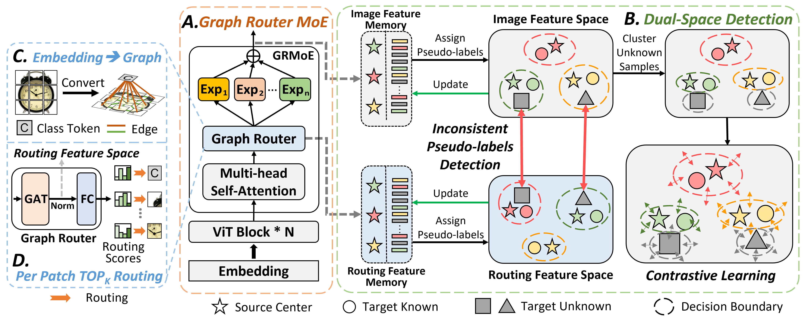

## [Mixture-of-Experts for Open Set Domain Adaptation: A Dual-Space Detection Approach](https://arxiv.org/abs/2311.00285)
The code will come soon.

 

## Abstract
Open Set Domain Adaptation (OSDA) aims to cope with the distribution and label shifts between the source and target domains simultaneously, performing accurate classification for known classes while identifying unknown class samples in the target domain. Most existing OSDA approaches, depending on the final image feature space of deep models, require manually tuned thresholds, and may easily misclassify unknown samples as known classes. Mixture-of-Experts (MoE) could be a remedy. Within a MoE, different experts handle distinct input features, producing unique expert routing patterns for various classes in a routing feature space. As a result, unknown class samples may display different expert routing patterns to known classes. In this paper, we propose Dual-Space Detection, which exploits the inconsistencies between the image feature space and the routing feature space to detect unknown class samples without any threshold. Graph Router is further introduced to better make use of the spatial information among image patches. Experiments on three different datasets validated the effectiveness and superiority of our approach.
